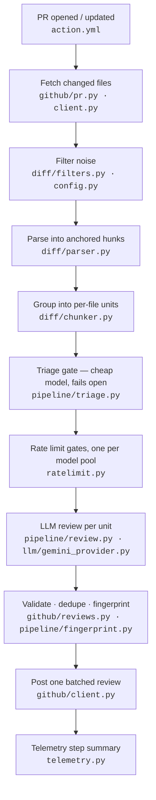

# ACROBOT

**A**I **C**ode **R**eview **O**rg **BOT** — a GitHub Action that reviews pull
request diffs with an LLM and posts inline comments, engineered so that being
wrong is cheap and being spammy is impossible.

When a PR opens, the bot fetches the changed hunks via the GitHub API (it
never checks out or executes the code it reviews), filters out machine noise,
reviews each hunk with a reasoning model, validates every finding against the
diff, and posts one batched review. Built around a hard constraint — the
**Gemini free tier** — so the scarce resource is rate-limit budget, not
dollars, which forced the parts that matter: client-side throttling with
graceful degradation, structured outputs everywhere, and content-based
idempotency.

**Field notes, day one:** caught 2/2 deliberately planted bugs (off-by-one,
div-by-zero) with exact counterexamples, found 2 real unplanned edge cases,
flagged genuine test gaps on its own PRs — and produced 2 instructive false
positives that seeded the eval dataset.

## How a review happens



Three rules govern the design:

1. **The LLM is untrusted input.** It lives behind one provider interface
   (`llm/provider.py`); its output is schema-validated JSON (`schemas.py`),
   never regex-parsed prose; and every finding's line anchor is verified
   against the parsed diff before posting. One hallucinated line number costs
   one finding, not the run — GitHub rejects the entire review otherwise.
2. **Request budget is the scarce resource.** Files are filtered before any
   model call; a two-clock rate limiter (RPM sliding window + RPD daily
   budget) meters what's left; and when the daily budget dies mid-run, the bot
   posts a partial review with a warning instead of failing CI red.
3. **Every run measures itself.** Per-stage tokens, latency, and hypothetical
   paid-tier cost land in the Actions step summary — $0 actual, economics
   known anyway.

Full rationale, security policy (fork PRs, `pull_request_target`), and the
v2 roadmap: [docs/architecture.md](docs/architecture.md).

## Repo map

| Path | What it does |
|---|---|
| `action.yml` | Composite Action consumers `uses:` — installs uv, runs `python -m acrobot` |
| `src/acrobot/__main__.py` | Orchestrator: reads the PR event, wires all stages, owns exit codes |
| `src/acrobot/config.py` | `BotConfig` — models, thresholds, rate caps, ignore globs; loaded from the target repo's `.github/acrobot.yml`, every key optional |
| `src/acrobot/schemas.py` | `Finding` / `FindingList` / `TriageResult` — the enforced LLM output contract |
| `src/acrobot/diff/parser.py` | GitHub `patch` strings → hunks with a line map (new-file line № → text); wraps patches in the synthetic headers unidiff requires |
| `src/acrobot/diff/filters.py` | Skips removed/binary/oversized files, lockfiles, generated code, ignore globs |
| `src/acrobot/diff/chunker.py` | Groups same-file hunks into `ReviewUnit`s under a token budget — one unit = one request = one file |
| `src/acrobot/ratelimit.py` | Two-clock limiter: RPM window blocks, RPD budget raises `DailyBudgetExhausted` for graceful partial reviews; injectable clock, tested without sleeping |
| `src/acrobot/llm/provider.py` | Vendor-agnostic `Provider` protocol; `ProviderError` (skip chunk) vs `ProviderAuthError` (abort run — deliberately not a subclass, so a dead key can't hide in a green check) |
| `src/acrobot/llm/gemini_provider.py` | The only file that knows Gemini exists: `reasoning=True` → `thinking_budget=-1`, response-schema enforcement, error mapping (incl. Google's 400-not-401 invalid-key quirk) |
| `src/acrobot/llm/prompts/` | The reviewer's rulebook + triage prompt; versioned, eval-tested (weekend 3) |
| `src/acrobot/pipeline/review.py` | Review loop: per-hunk prompt with a numbered new-file listing (the defense against hallucinated line numbers); findings stay paired with their source chunk; the model's self-reported path is overridden |
| `src/acrobot/pipeline/fingerprint.py` | Content-based comment fingerprints in hidden HTML markers — idempotent re-runs that survive force-pushes and shifted diffs |
| `src/acrobot/pipeline/triage.py` | Cheap-model gate (flash-lite, own quota pool) — scores units 0–10, only survivors reach the review model; every failure fails open |
| `src/acrobot/pipeline/postprocess.py` | Confidence threshold, severity floor, comment cap (keeps most-severe, not first-seen) |
| `src/acrobot/github/client.py` | Hand-rolled httpx GitHub client: auth, Link-header pagination, retry-after-aware backoff |
| `src/acrobot/github/pr.py` | Fetch changed files + existing comment bodies (idempotency input) |
| `src/acrobot/github/reviews.py` | `build_comments` (anchor validation, dedupe, markers) + `post_review` (one batched API call) |
| `src/acrobot/telemetry.py` | Per-stage usage → markdown table in `GITHUB_STEP_SUMMARY`, actual vs hypothetical cost |
| `evals/` | The measurement layer: labeled cases (`cases/*.yaml`) over real-PR fixtures, provider-boundary cassettes for deterministic replay, `runner.py` reporting recall/precision/FP-rate + cost; `notes.md` is the false-positive ledger |
| `src/acrobot/evalkit/` | Harness machinery (case schema, greedy 1:1 matching, cassette record/replay) — unit-tested like everything else |
| `tests/` | 49 tests: parsing, filters, fingerprints, rate limiter (fake clocks), fake-provider review loop, triage fail-open semantics, budget exhaustion, anchor validation, error paths |

## Usage

```yaml
# .github/workflows/review.yml in your repo
name: AI Review
on:
  pull_request:
    types: [opened, synchronize, reopened, ready_for_review]
concurrency:
  group: acrobot-${{ github.event.pull_request.number }}
  cancel-in-progress: true
permissions:
  contents: read
  pull-requests: write
jobs:
  review:
    # Same-repo PRs only: fork PRs can't read secrets, and
    # pull_request_target + untrusted checkout is an RCE footgun.
    if: github.event.pull_request.head.repo.full_name == github.repository
    runs-on: ubuntu-latest
    steps:
      - uses: actions/checkout@v4   # needed so the action can read .github/acrobot.yml
      - uses: FazleRas/acrobot@v1.0.0
        with:
          gemini_api_key: ${{ secrets.GEMINI_API_KEY }}
```

Optional tuning via `.github/acrobot.yml` (every key has a default):

```yaml
models:
  triage: gemini-3.1-flash-lite   # or gemini-flash-lite-latest to float
  review: gemini-2.5-flash
rate_limits:      # per-model pools; defaults sit just under the observed free-tier
  review:         # caps. Daily pools are shared across all runs on one API key.
    rpm: 4
    rpd: 18
  triage:
    rpm: 12
    rpd: 800
triage_threshold: 4
confidence_threshold: 0.6
max_comments: 10
severity_floor: warning
ignore:
  - "**/*.lock"
  - "**/generated/**"
```

> **Free-tier caveat:** Google's free tier may use prompts for model
> improvement — run this on public repos only unless you're on a paid tier.

## Status

- [x] Diff parsing, filters, provider protocol + Gemini adapter, rate limiter, fingerprints
- [x] Review pass: structured findings, anchor validation, batched posting, partial-review degradation
- [x] Dogfooding live on this repo and [AlphaLab](https://github.com/FazleRas/AlphaLab)
- [x] Chunker + postprocess: token budgeting, confidence/severity/cap enforcement
- [x] Quota-honest rate limiting: real free-tier caps, server-advised 429 retries, daily-limit → partial review
- [x] Triage tier: cheap-model gate on a separate quota pool, fails open
- [x] Eval harness: labeled cases from real PRs, cassette replay in CI, recall/precision/FP-rate reports
- [ ] Provider benchmark: Anthropic adapter behind the same interface, compared on the eval set
- [ ] v2: repository context layer — AST-aware retrieval feeding the review pass

## Development

```sh
uv sync
uv run pytest
uv run ruff check . && uv run mypy
```

## Evals

```sh
uv run evals/runner.py           # cassette replay — deterministic, free, runs in CI
uv run evals/runner.py --live    # real API calls; records/refreshes cassettes
```

Cases are labeled diffs from real PRs (expected findings with line tolerance +
keyword match; files where any finding is a false positive). Cassettes record
provider responses at the protocol boundary, so CI replays the whole pipeline
for free — and fails loudly when a prompt change invalidates a recording,
forcing a live re-record and a reviewed report before merge. Current baseline:
**75% recall, 100% precision** on the seed set — and across recordings the
same diff has scored 4/4, 2/4, and 3/4, so run-to-run variance is now a
measured fact instead of an invisible one. Honest numbers over good numbers.

Every PR here is reviewed by the bot itself (`self-review.yml`) — its false
positives become eval cases (see [evals/notes.md](evals/notes.md)), its fair
points become issues.
